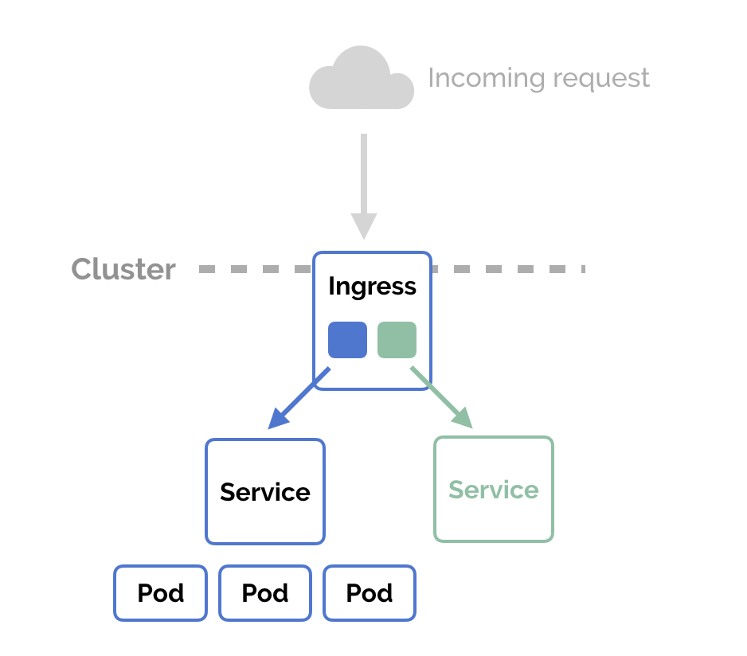

# Reddit Clone Kubernetes Deployment Guide

## Step 1: Clone the Source Code

The first step is to clone the source code for the app. You can do this by using the following command:

```bash
git clone https://github.com/LondheShubham153/reddit-clone-k8s-ingress.git
```

## Step 2: Containerize the Application using Docker

Write a `Dockerfile` with the following code:

```dockerfile
FROM node:19-alpine3.15

WORKDIR /reddit-clone

COPY . /reddit-clone

RUN npm install 

EXPOSE 3000

CMD ["npm", "run", "dev"]
```

## Step 3: Building Docker Image

Now it's time to build the Docker image from this `Dockerfile`. Use the following command to build the Docker image:

```bash
docker build -t <DockerHub_Username>/<ImageName> .
```

## Step 4: Push the Image to DockerHub

Push the Docker image to DockerHub so that our deployment file can pull this image and run the app in Kubernetes pods.

First, log in to your DockerHub account using the command:

```bash
docker login
```

Then use the following command to push the image to DockerHub:

```bash
docker push <DockerHub_Username>/<ImageName>
```

## Step 5: Write a Kubernetes Manifest File

In Kubernetes, a manifest file describes objects and their attributes in either YAML or JSON format. This file is used for creating Kubernetes resources like pods, deployments, and services. Below are the manifest files for deploying the Reddit clone application.

### 1. Write `Deployment.yml` File

Create a deployment file with the following code:

```yaml
apiVersion: apps/v1
kind: Deployment
metadata:
  name: reddit-clone-deployment
  labels:
    app: reddit-clone
spec:
  replicas: 2
  selector:
    matchLabels:
      app: reddit-clone
  template:
    metadata:
      labels:
        app: reddit-clone
    spec:
      containers:
      - name: reddit-clone
        image: <DockerHub_Username>/<ImageName>
        ports:
        - containerPort: 3000
```

### 2. Write `Service.yml` File

Create a service file with the following code:

```yaml
apiVersion: v1
kind: Service
metadata:
  name: reddit-clone-service
  labels:
    app: reddit-clone
spec:
  type: NodePort
  ports:
  - port: 3000
    targetPort: 3000
    nodePort: 31000
  selector:
    app: reddit-clone
```

## Step 6: Deploy the App to Kubernetes and Create a Service

With the deployment file ready and a running Kubernetes cluster, deploy the app to Kubernetes using:

```bash
kubectl apply -f Deployment.yml
```

Create a service using:

```bash
kubectl apply -f Service.yml
```

Check your deployment and service using:

```bash
kubectl get deployments
kubectl get services
```

## Step 7: Configure Ingress

Ingress defines a set of rules for routing inbound traffic to Kubernetes services. Below is the manifest file for configuring ingress.



### Write `Ingress.yml` File

Create an ingress file with the following code:

```yaml
apiVersion: networking.k8s.io/v1
kind: Ingress
metadata:
  name: ingress-reddit-app
spec:
  rules:
  - host: "domain.com"
    http:
      paths:
      - pathType: Prefix
        path: "/test"
        backend:
          service:
            name: reddit-clone-service
            port:
              number: 3000
  - host: "*.domain.com"
    http:
      paths:
      - pathType: Prefix
        path: "/test"
        backend:
          service:
            name: reddit-clone-service
            port:
              number: 3000
```

- **Enable Ingress in Minikube**: Minikube doesn't enable ingress by default. Enable it with:

  ```bash
  minikube addons enable ingress
  ```

- **Check Minikube Addons**: To view the current settings for addons, use:

  ```bash
  minikube addons list
  ```

- **Apply Ingress Settings**:

  ```bash
  kubectl apply -f Ingress.yml
  ```

- **Verify Ingress Resource**:

  ```bash
  kubectl get ingress ingress-reddit-app
  ```

## Step 8: Expose the App

Expose your deployment with:

```bash
kubectl expose deployment reddit-clone-deployment --type=NodePort
```

Test your deployment using:

```bash
curl -L http://192.168.49.2:31000
```

Expose the app service with:

```bash
kubectl port-forward svc/reddit-clone-service 3000:3000 --address 0.0.0.0 &
```

## Test Ingress

Finally, test your ingress using:

```bash
curl -L http://domain.com/test
```

Replace `domain.com` with your actual domain.